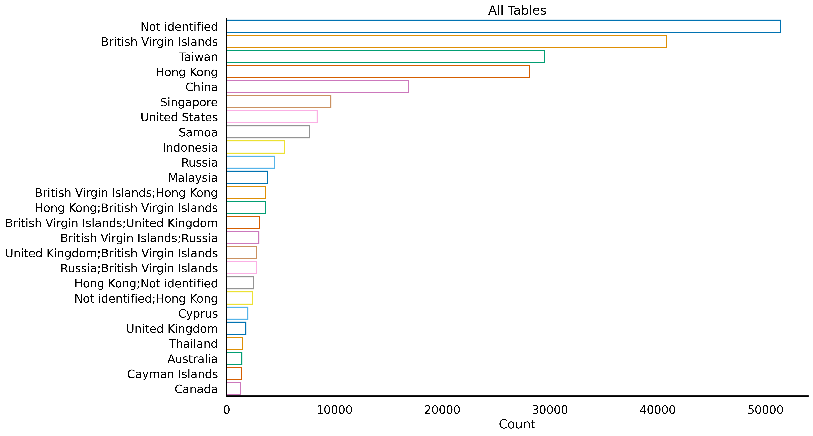

# Capstone_project_GA

### Datasets

- [Offshore Leaks](https://offshoreleaks-data.icij.org/offshoreleaks/csv/csv_panama_papers.2018-02-14.zip#_ga=2.95739225.475560190.1633554447-1739250866.1633374289)

- [Kaggle Data](https://www.kaggle.com/zusmani/paradisepanamapapers)

- [provided datasets](https://offshoreleaks.icij.org/pages/database)

- [Pandora Papers](https://www.icij.org/investigations/pandora-papers/about-pandora-papers-leak-dataset/)

### Data Structure

|                    |   # rows |   # columns |
|:-------------------|---------:|------------:|
| Nodes Intermediary |     9526 |           8 |
| Nodes Address      |    57600 |           8 |
| Nodes Entity       |   105516 |          17 |
| Nodes Officer      |   107190 |           7 |
| Edges              |   561393 |           8 |

