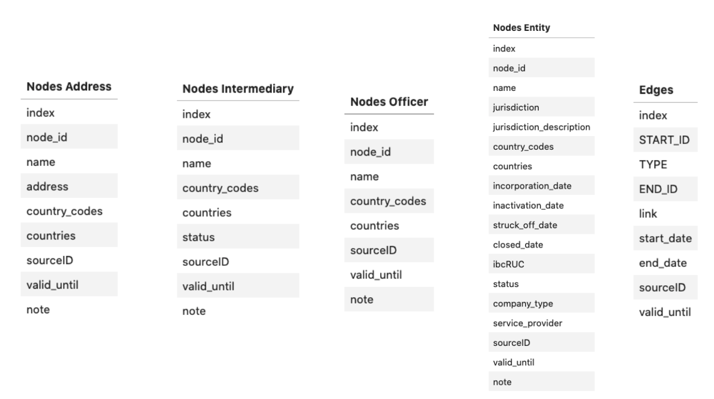
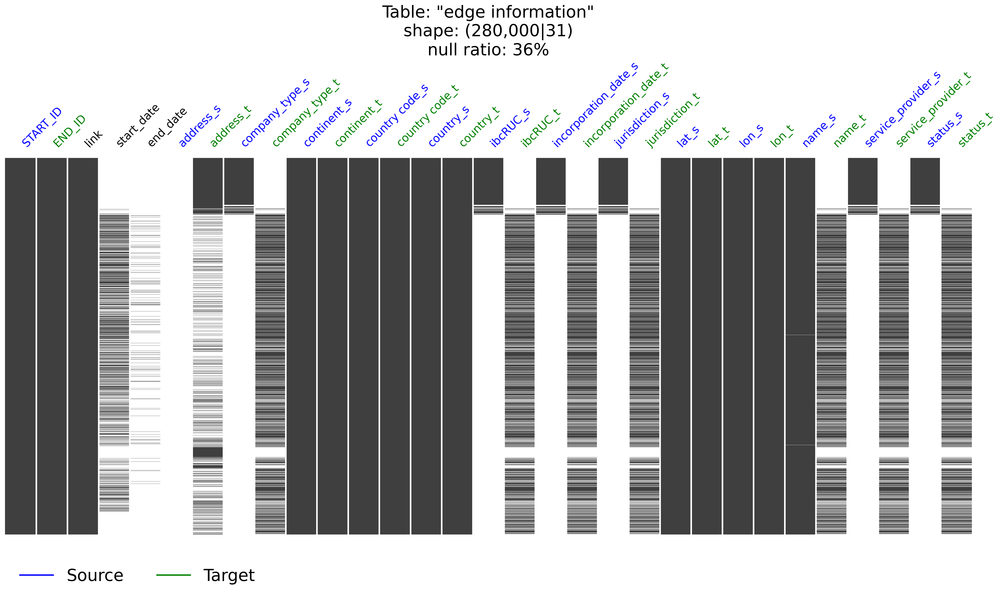
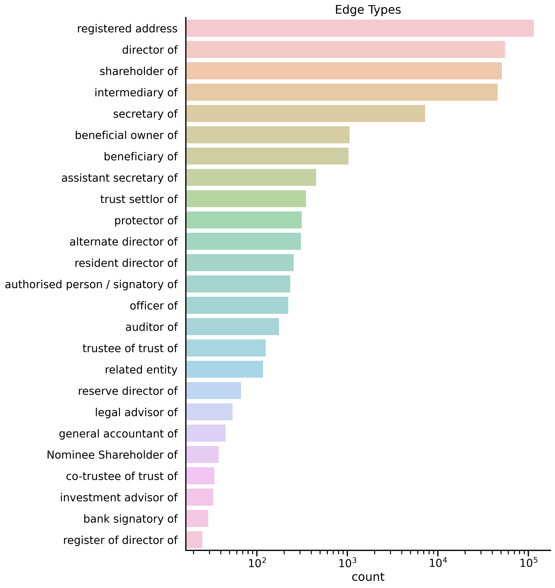

# Capstone project


### Datasets

The OFFSHORE LEAKS DATABASE was downloaded from <a href="https://offshoreleaks.icij.org/pages/database" target="_blank">ICIJ website</a> by __The International Consortium of Investigative Journalists__.

- [Offshore Leaks](https://offshoreleaks-data.icij.org/offshoreleaks/csv/csv_panama_papers.2018-02-14.zip#_ga=2.95739225.475560190.1633554447-1739250866.1633374289)
- [Kaggle Data](https://www.kaggle.com/zusmani/paradisepanamapapers)
- [provided datasets](https://offshoreleaks.icij.org/pages/database)
- [Pandora Papers](https://www.icij.org/investigations/pandora-papers/about-pandora-papers-leak-dataset/)


### Data Structure





|                    |   # rows |   # columns |
|:-------------------|---------:|------------:|
| Nodes Intermediary |     9526 |           8 |
| Nodes Address      |    57600 |           8 |
| Nodes Entity       |   105516 |          17 |
| Nodes Officer      |   107190 |           7 |
| Edges              |   561393 |           8 |


<details>
  <summary>Click to View the ratios of null values</summary>
  

### Null Values for edges


| edges      | Null Percentage   |
|:-----------|:------------------|
| end_date   | 94%               |
| start_date | 58%               |
| link       | 0%                |
| TYPE       | 0%                |
| END_ID     | 0%                |
| START_ID   | 0%                |


### Null Values for nodes

| nodes                    | Null Percentage   |
|:-------------------------|:------------------|
| state                    | 98%               |
| address                  | 79%               |
| ibcRUC                   | 66%               |
| incorporation_date       | 65%               |
| status                   | 65%               |
| company_type             | 63%               |
| service_provider         | 62%               |
| jurisdiction_description | 62%               |
| jurisdiction             | 62%               |
| longitude                | 37%               |
| latitude                 | 37%               |
| name                     | 20%               |
| country_codes            | 0%                |
| continents               | 0%                |
| countries                | 0%                |
| table                    | 0%                |
| node_id                  | 0%                |
    
</details>


<figure>
    
    <figcaption>Null values</figcaption>
</figure>


<figure>
    
    <figcaption>Distribution of data by edge types</figcaption>
</figure>


### Sources

- <a href="https://jakevdp.github.io/PythonDataScienceHandbook/04.13-geographic-data-with-basemap.html" target="_blank">Geographic data with basemap</a>

- <a href="https://stackoverflow.com/questions/19915266/drawing-a-graph-with-networkx-on-a-basemap" target="_blank">Draw a graph networkx on a map</a>

- <a href="https://rabernat.github.io/research_computing/intro-to-basemap.html" target="_blank">Basemaps</a>

- <a href="https://matplotlib.org/stable/gallery/text_labels_and_annotations/custom_legends.html" target="_blank">How to make custom legends</a>

- <a href="https://matplotlib.org/stable/tutorials/colors/colormaps.html" target="_blank">Colormaps in matplotlib</a>

- <a href="https://stackoverflow.com/questions/30914462/matplotlib-how-to-force-integer-tick-labels" target="_blank">How to force integer tick labels</a>

- <a href="https://www.tutorialspoint.com/how-to-insert-a-small-image-on-the-corner-of-a-plot-with-matplotlib" target="_blank">How to superimpose an image on plot</a>

- <a href="https://stackoverflow.com/questions/2553521/setting-axes-linewidth-without-changing-the-rcparams-global-dict" target="_blank">Setting axes linewidth</a>


- <a href="https://stackoverflow.com/questions/56104778/conditional-pip-install-in-google-colab-jupyter-notebook" target="_blank">Installations in colab</a>


### Installations


```bash
pip install pycountry-convert        # extracting location
pip install geopy                    # extracting location
```

- `basemap` installation on Colab

```
apt-get install -q libgeos
apt-get install -q libgeos-dev
pip install -q https://github.com/matplotlib/basemap/archive/master.zip
pip install -q pyproj
```