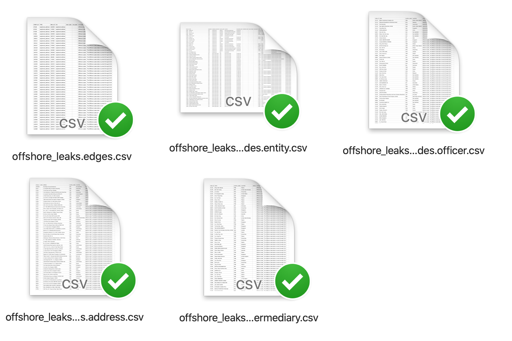
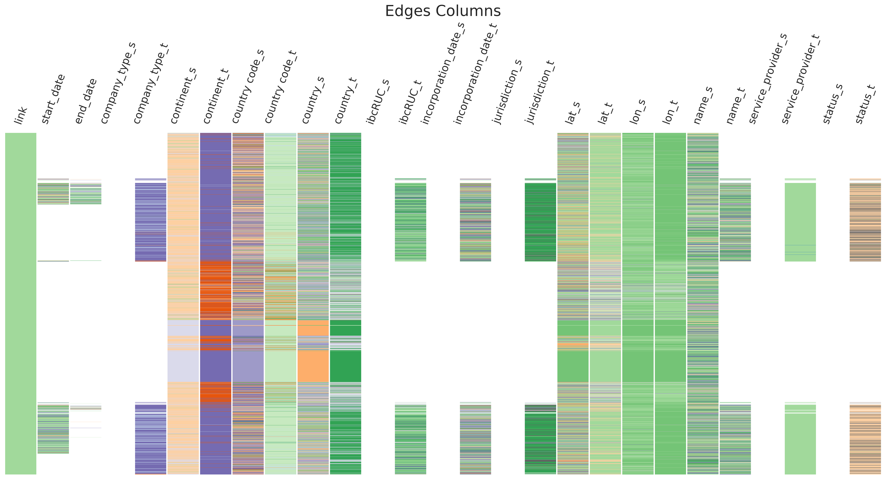
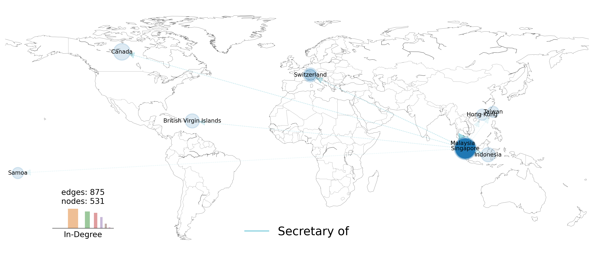
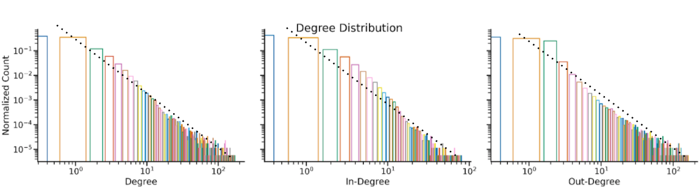

# Capstone project


### Contents:
- [Problem Statement](#Problem-Statement)
- [Steps](#Steps)
- [Datasets](#Datasets)
- [Data Structure](#Data-Structure)
- [Data Visualizations](#Data-Visualizations)
- [Conclusions](#Conclusions)
- [Future Work](#Future-Work)
- [Interactive App](#Interactive-App)
- [Sources](#Sources)
- [Required Installations](#Required-Installations)


### Problem Statement

This project was motivated by the news of <a href="https://www.icij.org/investigations/pandora-papers/about-pandora-papers-leak-dataset/" target="_blank">Pandora Papers</a>.

The goal of this project to learn more about the structure of similar networks and graphs in order to create visualizations/dashboard to explore the data.

Learning about these networks would give us a lot of insight into the nature of the leaks. This could even be used to predict future transactions.

### Steps:

- Data is downloaded from the source
- Combine the node tables into a single node table
- Add features such as "continent", "latitude" & "longitude"
- Subset the data into rows with single country listed
- Study the missing data and general structure of the data
- Construct graphs using the nodes and edges
- Study the degree distribution of the nodes
- Check other graph properties
- Inspect the connectivity of the graph
- To see if the data fits "preferential attachment model" or "small world model"
- Check to see if the graph is bipartite
- Extract the weakly-connected subgraphs from the main graph

### Datasets

The OFFSHORE LEAKS DATABASE was downloaded from <a href="https://offshoreleaks.icij.org/pages/database" target="_blank">ICIJ website</a> by __The International Consortium of Investigative Journalists__.


### Data Structure


<figure>
    
    <figcaption>Downloaded file structure</figcaption>
</figure>

|                    |   # rows |   # columns |
|:-------------------|---------:|------------:|
| Nodes Intermediary |     9526 |           8 |
| Nodes Address      |    57600 |           8 |
| Nodes Entity       |   105516 |          17 |
| Nodes Officer      |   107190 |           7 |
| Edges              |   561393 |           8 |


<figure>
    
    <figcaption>Data Frames</figcaption>
</figure>


<details>
  <summary>Click to View the ratios of null values</summary>
  

### Null Values for edges


| edges      | Null Percentage   |
|:-----------|:------------------|
| end_date   | 94%               |
| start_date | 58%               |
| link       | 0%                |
| TYPE       | 0%                |
| END_ID     | 0%                |
| START_ID   | 0%                |


### Null Values for nodes

| nodes                    | Null Percentage   |
|:-------------------------|:------------------|
| state                    | 98%               |
| address                  | 79%               |
| ibcRUC                   | 66%               |
| incorporation_date       | 65%               |
| status                   | 65%               |
| company_type             | 63%               |
| service_provider         | 62%               |
| jurisdiction_description | 62%               |
| jurisdiction             | 62%               |
| longitude                | 37%               |
| latitude                 | 37%               |
| name                     | 20%               |
| country_codes            | 0%                |
| continents               | 0%                |
| countries                | 0%                |
| table                    | 0%                |
| node_id                  | 0%                |
    
</details>


<figure>
    
    <figcaption>Null values</figcaption>
</figure>


<figure>
    
    <figcaption>Visualizing the edge and node information</figcaption>
</figure>


<figure>
    
    <figcaption>Distribution of data by edge types</figcaption>
</figure>

<figure>
    
    <figcaption>Visualizing the weakly-connected network with link property of "secretary of" on map</figcaption>
</figure>

### Interactive App

An interactive app is developed on <a href="https://share.streamlit.io/ozayn/capstone_project_ga/main/offozaynapp/offozaynapp/main.py" target="_blank">Streamlit</a>. The app gives you the ability to do the following:

- Visualize the nodes on the map
- Select a node property and see its distribution in barcharts
- Select a node, make a graph and visualizing it
- Select an edge type, visualize the connections on the map


### Conclusions

The log-log degree distribution follows the power law and this means that we could model the data by the __preferential attachment model__.

<figure>
    
    <figcaption>Degree Distribution</figcaption>
</figure>

### Future Work

- Study the robustness of the network
    - figure out the "minimum node cut" and "minimum edge cut"
- Use prediction models to predict possible future links between nodes using the current properties


### Sources

- <a href="https://jakevdp.github.io/PythonDataScienceHandbook/04.13-geographic-data-with-basemap.html" target="_blank">Geographic data with basemap</a>

- <a href="https://stackoverflow.com/questions/19915266/drawing-a-graph-with-networkx-on-a-basemap" target="_blank">Draw a graph networkx on a map</a>

- <a href="https://rabernat.github.io/research_computing/intro-to-basemap.html" target="_blank">Basemaps</a>

- <a href="https://matplotlib.org/stable/gallery/text_labels_and_annotations/custom_legends.html" target="_blank">How to make custom legends</a>

- <a href="https://matplotlib.org/stable/tutorials/colors/colormaps.html" target="_blank">Colormaps in matplotlib</a>

- <a href="https://stackoverflow.com/questions/30914462/matplotlib-how-to-force-integer-tick-labels" target="_blank">How to force integer tick labels</a>

- <a href="https://www.tutorialspoint.com/how-to-insert-a-small-image-on-the-corner-of-a-plot-with-matplotlib" target="_blank">How to superimpose an image on plot</a>

- <a href="https://stackoverflow.com/questions/2553521/setting-axes-linewidth-without-changing-the-rcparams-global-dict" target="_blank">Setting axes linewidth</a>


- <a href="https://stackoverflow.com/questions/56104778/conditional-pip-install-in-google-colab-jupyter-notebook" target="_blank">Installations in colab</a>


### Required Installations


```bash
pip install pycountry-convert        # extracting location
pip install geopy                    # extracting location
```

- `basemap` installation on Colab

```
apt-get install -q libgeos
apt-get install -q libgeos-dev
pip install -q https://github.com/matplotlib/basemap/archive/master.zip
pip install -q pyproj
```